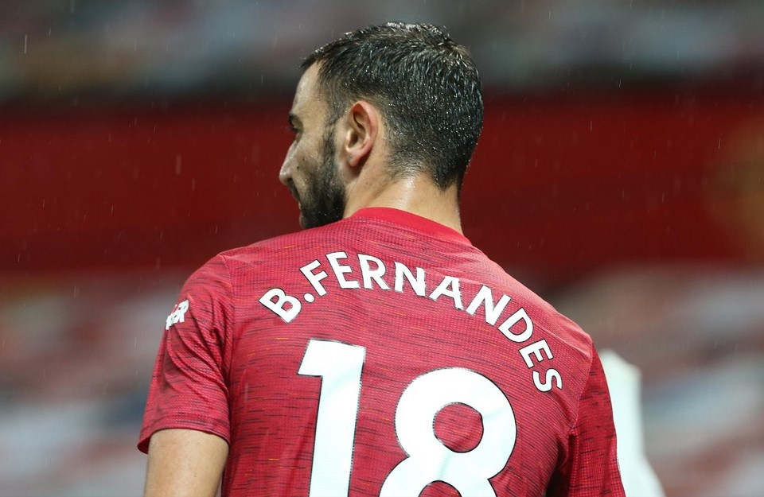

  כזכור, את ה – Wildcard הראשון של העונה ניתן לנצל עד לדד ליין של המחזור ה-16
  (אחרת הוא פשוט הולך לאיבוד), כך שמבחינתנו המחזור התשיעי כבר נופל בטווח הנכון
  שבו כדאי להשתמש בו (<a class="link" href="הציפים-שלנו">באמת שכבר כתבנו על זה</a>).

  אז אחרי שכבר הבנו פחות או יותר מי השחקנים החמים העונה וגם אחרי שראינו חצי
  מהסגל שלנו מנוטרל בגלל פגרת הנבחרות הידועה לשמצה, הגיע הזמן לבחון אילו שחקנים
  היו נכנסים לסגל שלנו במידה והיינו משתמשים ב – Wildcard לקראת המחזור התשיעי. מי
  מאיתנו ששרד את פגרת הנבחרות עם סגל מלא שהוא מרוצה ממנו, אולי אפשר לחכות עוד
  מחזור או שניים עם ניצול הצ'יפ.

  ליד כל שחקן שנבחר מופיע המחיר הנוכחי שלו ושיעור הקבוצות פנטזי אשר בחרו בו (TSB
  – Teams Selected By).

<strong><em>כללנו שחקן הגנה של קלופ בהרכב. באמת</em></strong>
 מקור, עמוד הפייסבוק:
<a href="https://www.facebook.com/OfficialFPL/"> OfficialFPL - Fantasy Premier League@</a>

<h3>שוערים</h3>
<h4>אמיליאנו מרטינז (אסטון וילה) – 4.8M, 27.1%.</h4>

  מרטינז ממשיך בפתיחת העונה המפתיעה שלו, כאשר באמתחתו ארבע רשתות נקיות ועצירת
  פנדל אחד בשבעה מחזורים בלבד. לוח המשחקים המצוין של וילה במחזורים הקרובים (לא
  פוגשת קבוצת Top 6 בשבעת המחזורים הקרובים), יחד עם המחיר הנוח שלו (שכנראה ימשיך
  לעלות) הופכים את הבחירה בו לקלה.

<h4>אלכס מק'ארתי (סאות'המפטון) – 4.5M, 20.0%.</h4>

  גם למקארתי יש כבר ארבע רשתות נקיות מתחילת העונה, כאשר המחיר שלו והצטלבות
  המשחקים הנוחה שקיימת לו מול מרטינז הופכים אותו לשוער המחליף האולטימטיבי.

  סימנו את הקבוצות עם לוח המשחקים הנוח יותר בחמשת המחזורים הקרובים – <a href="סקירת לוח משחקים - מחזורים 9-13">ממש כאן</a>.

<h3>הגנה</h3>
<h4>ז'ואו קנסלו (מנצ'סטר סיטי) – 5.4M, 2.2%.</h4>

  עושה לנו רושם שהמגן המצוין תקע יתד בהרכב של מנצ'סטר סיטי, כאשר פתח בארבעת
  המחזורים האחרונים, ובשלושה מהם רשם ניקוד (שתי רשתות נקיות ואסיסט). לוח המשחקים
  הנוח של סיטי בטווח הבינוני והעובדה שהוא כרגע מוחזק רק ע"י 2.2% מהמאמנים גורמים
  לנו לבחור בו לסגל שלנו. לאלו שיש להם תקציב וחוששים מאוד מה – Pep Roulette אפשר
  ללכת על קייל ווקר או רובן דיאס.

<h4>קורט זומה (צ'לסי) – 5.4M, 16.7%.</h4>

  המגן עם הניקוד הגבוהה ביותר במשחק בשמונת המחזורים הראשונים. לוח משחקים נוח
  יחסית, יכולת איום מוכחת במצבים הנייחים ומחיר שווה לכל כיס מכניסים אותו לסגל
  שלנו. כמובן שגם בן צ'ילוול הוא אופציה מצוינת אבל המחיר כבר קפץ ל-6.0 מיליון
  (ויש גם שאלה של כשירות לגביו בנוגע למחזור הקרוב).

<h4>ג'יימס ג'סטין (לסטר) – 4.8M, 22.0%.</h4>

  שלושה משחקי בית נוחים בחמשת המחזורים הקרובים למגן של מוליכת הטבלה, כמו גם
  הסיכוי לתמורה התקפית מעמדת המגן (כבר רשם שער ובישול העונה) מקנים לו את המקום
  בסגל שלנו.

<h4>ולדימיר קופל (ווסטהאם) – 4.5M, 1.7%.</h4>

  המלצנו על המגן הצ'כי המצוין כבר במחזור שעבר והוא סיפק את הסחורה עם 8 נקודות.
  קופל הינו מגן התקפי (שני בישולים בחמש הופעות העונה), כאשר לווסטהאם לוח משחקים
  לא רע בחמשת המחזורים הקרובים. המחיר הנוח ואחוזי ההחזקה הנמוכים (לעת עתה) רק
  מקלים על ההחלטה להכניס אותו לסגל שלנו.

<h4>ניקו וויליאמס (ליברפול) – 3.9M, 3.5%.</h4>

  היינו חייבים להשאיר נציג לליברפול בקבוצה שלנו. סתם, זה רק בגלל שהוא ממש זול.
  מה שכן, לאור מצוקת המגנים, יש סיכוי ממשי שהוא יראה דשא במחזורים הקרובים –
  תזכרו איפה קראתם את זה בפעם הראשונה.

<h3>קישור</h3>
<h4>קווין דה בריינה (מנצ'סטר סיטי) – 11.5M, 16.2%.</h4>

  הקשר הבלגי המצוין התחיל להיכנס לקצב בשבועות האחרונים ועם לוח משחקים שכולל
  ארבעה משחקי בית מול קבוצות תחתית בשבעת המחזורים הקרובים אנחנו חושבים שכדאי
  להכניס אותו לסגל כבר עכשיו. כדאי למהר לפני שאחוז ההחזקה יתחיל לטפס.

<strong><em>ימשיך לחגוג? ברונו פרננדש</em></strong>
 מקור, עמוד הפייסבוק:
<a href="https://www.facebook.com/OfficialFPL/"> OfficialFPL - Fantasy Premier League@</a>

<h4>ברונו פרננדש (מנצ'סטר יונייטד) – 10.6M, 25.9%.</h4>

  אמנם יש לו כבר שלושה בלאנקים העונה, אבל כשהוא נותן ניקוד, זה בדרך כלל בצרורות
  (שלושה משחקים עם ניקוד בספרות כפולות העונה). בששת המחזורים הקרובים, למעט
  הדרבי, הוא פוגש קבוצות שהגנות הן לא החלק החזק שלהן (וחוצמזה, יונייטד חייבת
  להדביק במהרה את לסטר בכמות הפנדלים) – אנחנו איתו.

<h4>חאכים זייץ' (צ'לסי) – 8.2M, 14.0%.</h4>

  שתיים וחצי הופעות הספיקו לקשר המרוקאי כדי לטפס מעלה בטבלת מסירות המפתח של כל
  הליגה, כאשר הוא רשם 25 נקודות בשתי ההופעות האחרונות שלו. הסגנון ההתקפי של
  צ'לסי ובעיות הכשירות בקרב שחקני הקישור מספיקות לנו בכדי לקפוץ על ההזמנות
  ולהכניס אותו לסגל שלנו.

<h4>ג'ק גריליש (אסטון וילה) – 7.5M, 35.9%.</h4>

  ארבעה שערים ושישה בישולים בשבעה משחקים הם מנת חלקו של הקשר המצוין מתחילת
  העונה, כשמחברים את זה עם לוח המשחקים של וילה במחזורים הקרובים ושיעור ההחזקה
  המטפס שלו בקרב המנג'רים מבינים שכדאי להיות בצד שמחזיק אותו מאשר בצד שלו.

<h4>תומס סוצ'ק (ווסטהאם) – 4.9M, 2.8%.</h4>

  נכון שהוא פה בעיקר בגלל המחיר, אבל מדובר בשחקן הרכב קבוע, עם יכולת איום ממשי
  על השער בכל מצב נייח, אחלה קשר חמישי.

<h3>התקפה</h3>
<h4>ג'יימי וארדי (לסטר) – 10.1M, 21.8%.</h4>

  מלך הפנדלים של העונה הזו (כבש חמישה מתוך שישה שבעט), עם לוח משחקים מצוין,
  אנחנו מחזיקים אצבעות לעוד Vardy Party, לפחות בחמשת המחזורים הקרובים.

<h4>דומיניק קאלברט לוין (אברטון) – 7.8M, 57.2%.</h4>

  מאוד לא מקורי מבחינתנו, אבל בשלושת המחזורים הקרובים פוגשת אברטון את פולהאם,
  לידס וברנלי ואנחנו לא רוצים להישאר מחוץ לחגיגה. יכול להיות שבעוד כמה מחזורים
  הוא יהיה מועמד לחילוף, אבל בשלב הזה אנחנו אתו.

<h4>אוליבר ווטקינס (אסטון וילה) – 6.1M, 7.3%.</h4>

  גם אנחנו לא מאמינים לזה שהגענו למצב שיש לנו שלושה שחקני אסטון וילה בהרכב, אבל
  ווטקינס כבר עם שישה שערים מתחילת העונה וממוקם במקום הרביעי במדד ה-ICT בקרב
  החלוצים – מה שמראה על עקביות. שילוב של לוח משחקים נוח, מחיר טוב ואחוז החזקה
  נמוך גורמים לנו לבחור בנציג נוסף של אסטון וילה לסגל שלנו.

