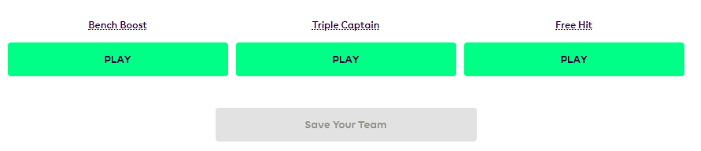

<h2>הצ'יפים שלנו?! לא נכון! מתי?</h2>

  האנשים הטובים שהמציאו את החוקים במשחק הפנטזי פריימר ליג יצרו עבורנו חמישה
  צ'יפים בהם אנו יכולים לעשות שימוש על מנת למקסם את כמות הנקודות שאנו צוברים
  במהלך העונה.

  שימוש מושכל (וכמובן, קצת מזל) בניצול הצ'יפים הללו יכול לפצות על שבועות של
  תסכול מחילופים רעים ובחירות קפטן לא מוצלחות ולהקפיץ אותנו במעלה טבלאות הליגות
  השונות בהן הקבוצה שלנו משתתפת.

בואו נראה איך עושים זאת נכון (או לפחות מנסים).

<h3>איזה צ'יפים קיימים בכלל</h3>

  לפני שנתחיל למנות את הצ'יפים שקיימים במשחק צריך לקחת בחשבון כי ניתן להשתמש
  בצ'יפ אחד בלבד במהלך מחזור משחקים בודד, לדוגמא – לא נוכל להשתמש בכרטיס
  החילופים החופשי (Wildcard) ובאותו מחזור לנצל את אחד הצ'יפים האחרים (Triple
  Captain/Free Hit/Bench Boost).

  כמו כן, נזכור כי שימוש בצ'יפ כלשהו גורר
  <strong>איפוס של כמות ההעברות הצבורה</strong> הקיימת לנו נכון לתחילת המחזור בו
  אנו משתמשים בצ'יפ. כלומר, במידה והיו לנו שתי העברות שמורות, במחזור העוקב
  למחזור המשחקים בו השתמשנו בצ'יפ נהיה זכאים להעברה חופשית אחת בלבד.

אפשרות שימוש בצ'יפ Wildcard

אפשרות שימוש בצ'יפים האחרים

אז אילו צ'יפים עומדים לרשותנו במהלך העונה?

<h3>כרטיס חילופים חופשי (Wildcard) – פעמיים במהלך העונה</h3>

  צ'יפ זה מאפשר לנו לבצע מספר חילופים בלתי מוגבל במהלך מחזור משחקים מסוים (כולל
  חילופים שכבר בוצעו במהלך מחזור המשחקים המדובר) – בחינם וללא קנס.

  במהלך העונה נוכל להשתמש פעמיים בצ'יפ זה, כאשר הפעם הראשונה חייבת להיות עד לדד
  ליין של המחזור ה-16 בתאריך 28.12.2020 בשעה 17:30 (שעון ישראל) והפעם השנייה
  תהיה לאחר תאריך זה. במידה ולא נשתמש בצ'יפ הראשון עד לתאריך הנזכר לעיל, אזי
  הזכאות לשימוש בו תפוג.

  חדשים בפנטזי פריימר ליג?
  <a href="פנטזי_פריימר_ליג_החוקים" class="link">הסבר מפורט על שאר החוקים במשחק נמצא כאן.</a>

<h3>Triple Captain</h3>

  צ'יפ זה מאפשר לנו לשלש במחזור משחקים מסוים את הניקוד של הקפטן שלנו, על חשבון
  ההכפלה הרגילה של ניקוד הקפטן במחזור משחקים רגיל. כמובן שאם הקפטן שלנו כלל לא
  שיחק במחזור המשחקים בו השתמשנו בצ'יפ, אזי ההטבה עוברת לקפטן המשנה.

<h3>Bench Boost</h3>

  צ'יפ זה מאפשר לנו להוסיף לסך הנקודות הנצבר גם את הניקוד של שחקני הספסל שלנו,
  כך שלמעשה הניקוד של כלל 15 שחקני הסגל ייחשב במחזור המשחקים בו נפעיל את הצ'יפ.

<h3>Free Hit</h3>

  צ'יפ זה מאפשר לנו לבצע כמות חילופים בלתי מוגבלת במחזור משחקים מסוים, עבור
  מחזור משחקים מסוים, כך שבתום מחזור המשחקים בו הפעלנו את הצ'יפ נחזור אל הסגל
  שהיה לנו טרם הפעלת הצ'יפ.

<h2>יאללה טקטיקה! (וגם הסבר על מחזור משחקים כפול)</h2>

  עונת הפנטזי פריימר ליג היא עונה ארוכה ותמיד טוב לשמור כמה קלפים בשרוול. תוסיפו
  לכך את העובדה שבדרך כלל המחזורים האחרונים של העונה מתאפיינים במספר מחזורים בהם
  יותר מקבוצה אחת משחקת פעמיים באותו מחזור משחקים (DGW – Double Game Week)
  וקיבלתם את המתכון המושלם לשימוש בצ'יפים.

  נסייג ונאמר, שבעונת 2019/2020 ובסבירות מסוימת גם בעונת המשחקים הנוכחית
  (2020/2021), מגפת הקורונה השפיעה ועלולה להשפיע על לוח המשחקים בצורה כזו
  שההצעות לשימוש בצ'יפים הניתנות במסגרת שורות אלו יהיו פחות רלוונטיות.

  לפני שנמשיך, לטובת החדשים שבינינו נתעכב אודות הסבר קצר אודות מחזור משחקים
  כפול (DGW – Double Game Week). מכיוון ובמקביל למשחקי הפריימר ליג משחקות
  קבוצות הליגה במפעלים נוספים דוגמת המפעלים האירופאים, הגביע האנגלי וגביע הליגה
  (שסוף סוף ביטלו בו את המשחק החוזר במקרה של תיקו!) לעיתים נוצר צורך לדחות
  משחקים מסוימים למועדים מאוחרים יותר, בדרך כלל לשלבים המאוחרים יותר בעונה.

  אותם משחקים שנדחו מצורפים בעל כורחם למחזור משחקים אשר משוחק במועדו המקורי כך
  שניקוד הפנטזי במשחקים דחויים אלו נזקף לניקוד של מחזור המשחקים המשוחק במועדו.
  בדרך כלל (בעונה נטולת השפעות קורונה) ישנם בין 2-4 מחזורי משחקים בהם חלק
  מהקבוצות משחקות פעמיים ומכאן השם – מחזור משחקים כפול.

  ההכרזה על אותם מחזורי משחקים (GW – Game Weeks) הכוללים יותר מעשרה משחקים
  מתבצעת מעת לעת על ידי פלטפורמת ה – Fantasy Premier League וניתן פשוט לעקוב אחר
  המשחקים המשויכים לכל מחזור באפלקציית המשחק.

<h3>טקטיקה!! עכשיו באמת</h3>

  אז נתחיל עם הברכה שמגיעה אלינו פעמיים בעונה והיא ה – Wildcard, צ'יפ המאפשר לנו
  לבצע העברות ללא הגבלה בשבוע משחקים מסוים אותו נבחר.

  אישית, את ה- Wildcard הראשון (אשר ניתן לנצלו עד למחזור ה-16) אנחנו אוהבים לנצל
  בסביבות המחזור ה-10 לעונה, לאחר שכבר הבנו את הכיוון של העונה מבחינת השחקנים
  החמים, שחקנים פצועים ושחקנים שזו פשוט לא הולכת להיות העונה שלהם.

  כמובן, שלפעמים המזל לא מבקר אצלנו בתחילת העונה וכבר לאחר מספר מחזורים בודד
  אנחנו מבינים שבחרנו לסגל יותר מידי שחקני ספסל, פצועים ומורחקים. במקרה כזה, אם
  המצב הוא כזה שאי אפשר לשפץ את הסגל בעבור קנס מינורי – שווה לשקול שימוש מוקדם
  ב– Wildcard.

  את השימוש ב- Wildcard השני, תחת ההנחה שאין לנו יותר מידי תקלות בדרך ולא איבדנו
  קשר עין עם המקומות הראשונים בליגות שלנו אנחנו מנסים לדחות כמה שיותר, עד לשלב
  שבו כבר נדע מהם המחזורים הכפולים (DGW), או לפחות עד שנדע פחות או יותר איזה
  קבוצות צפויות לשחק בכל אחד מהמחזורים הללו.

  נכון לעכשיו, מחזור 29 אשר נקבע לתאריך 20.03.2021 מתנגש עם משחקי רבע גמר הגביע
  האנגלי, כך שרוב הסיכויים שהמחזור הזה יהיה מחזור משחקים חסר, אשר יושלם במהלך
  המחזורים הבאים. המחזורים בהם יושלמו המשחקים תלויים בעיקר בזהות המעפילות לשלבים
  המאוחרים של הגביע האנגלי ולהצלחתן של הנציגות האנגליות במפעלים האירופאים.

  בהתאם לאמור לעיל, אנחנו נשתמש בצ'יפים של ה – Triple Captain וה- Bench Boost
  במחזורי המשחקים הכפולים, כאשר בהתאם לזהות המשחקים הצפויים בכל אחד מהמחזורים
  הכפולים נשבץ את הצ'יפ המתאים מבחינתנו (מי יסרב ל- Triple Captain של סאלח בשבוע
  משחקים הכולל שני משחקי בית?!).

  בנוסף, חשוב להתאים את החילופים שאנחנו מבצעים בהתאם לצ'יפ שאנחנו רוצים להשתמש
  בו. לדוגמא – במידה והחלטנו לנצל את צ'יפ ה- Bench Boost בשבוע מסוים, כדאי
  להשתמש בחילופים במחזורי המשחקים הקודמים לשבוע המשחקים בו נפעיל את הצ'יפ על מנת
  להכניס לסגל שחקנים שמשחקים באופן קבוע.

  לגבי הצ'יפ האחרון שנותר (Free Hit) אנחנו חייבים לומר שיש שתי גישות שונות, אשר
  המשותף לשתיהן הוא המכנה המרכזי בפנטזי פריימר ליג – המזל.

  הגישה הראשונה אומרת שכדאי לנצל את הצ'יפ הזה דווקא באותו מחזור משחקים רזה
  שמושפע ישירות ממשחקי הגביע האנגלי (נכון לעכשיו מדובר על מחזור 29, אין לדעת מה
  תהיה השפעת הקורונה).

  באמצעות השימוש בצ'יפ דווקא במחזור המשחקים הזה, אנו נבנה קבוצה למחזור בודד
  המורכבת מהשחקנים של הקבוצות המשחקות במחזור משחקים זה, כאשר יותר מסביר שהקבוצות
  הגדולות יעפילו לשלבים המאוחרים בגביע, כך שמרבית סגלי הפנטזי בשבוע המשחקים הזה
  כמעט ולא ייהנו מניקוד של השחקנים המרכזיים בהם. כמובן שהכדאיות של השיטה הזו
  תלויה בעיקר בלוח המשחקים בפועל במחזור המדובר, כמו גם בכמות המחזורים הכפולים
  שיתקיימו בפועל (אם יהיו יותר משלושה מחזורים כפולים יכול ויהיה עדיף לנצל גם את
  הצ'יפ הזה גם במסגרת מחזור משחקים כפול).

  הגישה השנייה בקשר לצ'יפ הזה אומרת ששווה לנצל אותו בהתאם לתחושת בטן.  אין
  מה לעשות – לפעמים אנחנו פשוט בטוחים שאנחנו יודעים לתפוס בדיוק מי הקבוצות
  שישמרו על רשת נקייה ומי מהקבוצות צפויה לכבוש בצרורות.

  בסופו של דבר, אנחנו מאמינים בתכנון מראש של השימוש בצ'יפים השונים – אז אל תשכחו
  לעקוב אחרי כמות ומועדי המחזורים הכפולים.

