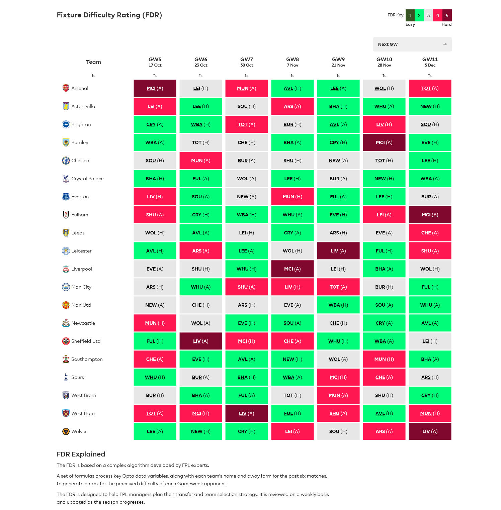

  אז אחרי שפגרת הנבחרות הסתיימה ומשחקי שלב הבתים במסגרות השונות של אופ"א מתחילים
  (מיד לאחר המחזור החמישי), הגיע הזמן לבחון את לוח המשחקים למחזורים הקרובים
  ולנסות להבין איזה קבוצות נהנות מלוח משחקים נוח אשר יעזור לנו להכניס את שחקניהם
  לסגל הקבוצה שלנו.

  אחת לכמה מחזורים חשוב להעיף מבט על לוח המשחקים על מנת לנסות ולהבין מי הן
  הקבוצות שיכולות לספק רצף תוצאות טובות בטווח הקצר וכמובן, לבצע חילופים בהתאם
  לכך.

  נכון לשלב זה, התוצאות של ארבעת מחזורי הפתיחה של העונה יחד עם סקירה של לוח
  המשחקים לחמשת המחזורים הקרובים יכולים לעזור לנו להבין האם הקבוצה שבנינו בתחילת
  העונה טובה מספיק בשביל להוות שלד למחזורים הקרובים, או שמא, כדאי לנו כבר להשתמש
  ב – Wildcard הראשון של העונה בשלב כל כך מוקדם.

  <a class="link" href="הציפים-שלנו">סקירה מלאה על איך ומתי להשתמש בצ'יפים נמצאת כאן</a>
    
  <a href="#">הרכב מוצע למי שהולך על ווילדקארד במחזור 4</a>

<h3>נשארו בחוץ</h3>

  לפני שנסקור את הקבוצות שלדעתנו עומדות בפני רצף משחקים נוח חשוב לציין שאנחנו
  משאירים הפעם בחוץ את ליברפול (אמנם ישחקו 3 פעמים באנפילד, אך בין היתר מארחים
  את לסטר ומתארחים אצל אברטון ומנצ'סטר סיטי), מנצ'סטר סיטי (3 משחקי חוץ בחמשת
  המחזורים הקרובים, כולל מפגשים עם ארסנל, ליברפול וטוטנהאם) ומנצ'סטר יונייטד
  (למרות שלושה משחקי בית, פוגשים את צ'לסי וארסנל בבית ואת אברטון בחוץ).

  כמובן שאצל הקבוצות הללו, גם לוח משחקים קשה לא אמור לפגוע בצבירת הניקוד של
  השחקנים המובילים, אבל כשמחברים לכך את תחילת העונה ההפכפכה ואת העובדה שהמפעלים
  האירופאים מתחילים ואמורים לגרום לעומס ויותר מכך, לחיסורי קורונה – אפשר לנסות
  לתת משקל גדול יותר לשחקנים של הקבוצות להן לוח משחקים נוח יותר בטווח הקצר.

צילום מסך של ה-FDR מאתר הפנטזי

<h3>לוח משחקים מפנק</h3>

  <em
    >צ'לסי – סאותהמפטון (ב), מנצ'סטר יונייטד (ח), ברנלי (ח), שפילד יונייטד (ב),
    ניוקאסל (ח).</em
  >

  אנחנו מאמינים שפרנק למפארד מתחיל להבין את מי מהצעצועים החדשים שקנו לו הוא צריך
  לשבץ בהרכב כדי למצוא איזון על המגרש. המחזורים הקרובים מזמנים לו פגישה עם
  קבוצות שנותנות לשחק כדורגל (סאותהמפטון, מנצ'סטר יונייטד) וקבוצות שפתחו בצורה
  לא טובה את העונה (ברנלי, שפילד יונייטד), מה שלדעתנו אומר שהרבה מאוד נקודות
  הולכות לבוא מהכיוון של הכחולים במחזורים הקרובים.

  שימו לב שלמרות שקפה/קבז'רו ככל הנראה עומדים לחזור לשער (מנדי הצליח להיפצע
  בפגרת הנבחרות) היינו ממליצים על שחקני צ'לסי בכל העמדות, כאשר בהגנה זומה
  וצ'ילוול עם אחוזי בעלות נמוכים מאוד, בקישור לא חסרות אופציות (הארבץ, מאונט,
  פוליסיק – לעקוב אחרי ההרכבים הצפויים) ובהתקפה יש לנו תחושה שאפילו ורנר יתחיל
  לכבוש.

מחפשים אקס-פקטור? <a href="#">יש כאן רשימה של שחקנים עם אחוזי החזקה נמוכים<a>

  <em
    >טוטנהאם – ווסטהאם (ב), ברנלי (ח), ברייטון (ב), ווסט ברום (ח), מנצ'סטר סיטי
    (ב)</em
  >

  תסתכלו על לוח המשחקים הזה ותגידו לנו שהארי קיין ויונג מין סון לא הולכים להמשיך
  בחגיגה.

  שלושה משחקי בית בתוספת שני משחקי חוץ נוחים מאוד אמורים להמשיך לספק כר נוח
  לתסמונת העונה השנייה של ז'וזה מוריניו, אשר מפתיחת המחצית השנייה של המפגש מול
  סאות'המפטון בסיינט מרי במחזור השני נראית פשוט מצוין.

  מעבר לשני הכוכבים שהזכרנו למעלה, שלדעתנו צריכים להיות בכל קבוצת פנטזי בשלב הזה
  של העונה, כדאי להעיף מבט על אריק דייר (בלם פותח במחיר נוח), כאשר בגזרת המגנים
  יש מבחר עם פוטנציאל ניקוד גבוה – אך עם סכנת רוטציה גבוהה למדי.

  <em
    >וולבס – לידס (ח), ניוקאסל (ב), קריסטל פאלאס (ב), לסטר (ח), סאות'המפטון
    (ב)</em
  >

  למרות פתיחת עונה מגומגמת שכללה הפסד לא אופייני לווסטהאם, לוח המשחקים של החבורה
  של נונו אספריטו סנטו נראית בעלת פוטנציאל גבוה, בעיקר בפן ההגנתי. שלושה משחקי
  בית אל מול קבוצות מהדרג הבינוני של הליגה, לקבוצה ששמרה על רשת נקייה בשבעה מתוך
  תשעת משחקי הבית האחרונים שלה בליגה – זה לא משהו שכדאי לפספס.

  על כן, אנחנו חושבים ששחקן הגנה של וולבס זהו מצרך נדרש בסגל למחזורים הקרובים,
  כאשר רוי פטריסיו, רומיין סאייס וקונור קואדי הם החשודים המידיים.

  <em
    >פולהאם – שפילד יונייטד (ח), קריסטל פאלאס (ב), ווסט ברום (ב), ווסטהאם (ח),
    אברטון (ב)</em
  >

  אם לא עכשיו אז מתי? החבר'ה של סקוט פארקר יהיו חייבים לקחת ניקוד בשלב מסוים
  ועושה רושם שארבעת המחזורים הקרובים הם הזדמנות מצוינת עבורם. בעונה הקודמת בהם
  שיחקה ב – Top Flight צברה הקבוצה 21 מתוך 26 הנקודות שלה בקרייבן קוטג' עם ממוצע
  הבקעות של מעל שער למשחק.

  אם אתם חושבים כמונו שמאזן שערי הזכות של פולהאם צפוי להשתפר במחזורים הקרובים
  ניתן לבחור כמובן באלכסנדר מיטרוביץ ובמושאל החדש והמסקרן מצ'לסי – רובן
  לופטוס-צ'יק.

<h3>כדאי לשים לב גם אליהן</h3>

  <em
    >אברטון – ליברפול (ב), סאות'המפטון (ח), ניוקאסל (ח), מנצ'סטר יונייטד (ב),
    פולהאם (ח)</em
  >

  אחרי פתיחת עונה כל כך מרשימה פשוט אי אפשר להתעלם מאברטון. נכון שהסטטיסטיקה
  צפויה להתיישר וכנראה שליברפול ומנצ'סטר יונייטד לא יחזיקו במאזן הגנתי כל כך
  עגום לאורך זמן (רק ווסט ברום ספגה יותר שערים בארבעת המחזורים הראשונים), אבל
  נכון לעכשיו נראה שלוח המשחקים הקרוב של אברטון יכול להמשיך ולתמוך בהמשך תוצרת
  טובה לקבוצות הפנטזי, לפחות בחלק ההתקפי.

  מיותר לציין כי דומיניק קלברט לווין וחאמס רודריגז הם השחקנים החמים כרגע, אבל גם
  גילפי סיגורדסון שחזר להרכב לאחרונה (והספיק למצוא את הרשת במשחקי הנבחרת)
  וריצ'רלסון שנהנה ממנוחה בפגרת הנבחרות לאור פציעה צריכים להילקח בחשבון.

  <em
    >קריסטל פאלאס – ברייטון (ב), פולהאם (ח), וולבס (ח), לידס (ב), ברנלי (ח)</em
  >

  לוח משחקים שלא כולל אף יריבה מקבוצת ה – Big Six הוא תמיד לוח משחקים מסקרן.
  פאלאס, שלמעט במחזור האחרון הצליחה לעמוד שווה בשווה מול יריבות לא קלות במחזורים
  הראשונים (סאות'המפטון, מנצ'סטר יונייטד ואברטון), בהחלט אמורה לאגור כמה נקודות
  במחזורים הקרובים. היתרון הנוסף במקרה הזה הוא המחיר הנוח של השחקנים המובילים
  בקבוצה דוגמת ווילפריד זאהה, אנדרוס טאונסאנד (שהשתלט על המצבים הנייחים העונה),
  ג'ורדן איוו וטייריק מיצ'ל (המגן הימני).

  <em
    >ברייטון – קריסטל פאלאס (ח), ווסט ברום (ב), טוטנהאם (ח), ברנלי (ב), אסטון
    וילה (ח)</em
  >

  ברייטון אמנם צברה רק 3 נקודות בארבעת מחזורי הפתיחה, אך למרות מפגשים אם צ'לסי,
  מנצ'סטר יונייטד (וקורות השער שלה) ואברטון היא הצליחה לכבוש בכל משחק ומשחק.
  חמשת המפגשים הקרובים שלה נוחים בהרבה ואנחנו מניחים שהכדורגל ההתקפי של גראהם
  פוטר ימשיך לתת נקודות למאמני הפנטזי.

  שווה לשים לב לניל מאופיי החלוץ הצרפתי, לאנדרו טרוסארד הקשר הבלגי ואפילו להמר
  על המגן המוכשר טייריק למפטי (שלאחרונה החל להיות מקושר לבאיירן מינכן).

אסטון וילה – לסטר (ח), לידס (ב), סאות'המפטון (ב), ארסנל (ח), ברייטון (ב)

  עם שלושה משחקי בית בחמשת המחזורים הקרובים ואחרי התצוגה ההיסטורית מול ליברפול
  במחזור האחרון, אי אפשר לוותר על אזכור של אסטון וילה.

  אמנם סביר להניח שההגנה תמשיך לספוג, אבל עושה רושם שבקישור של וילה אפשר למצוא
  כמה שחקנים שניתן להכניס לסגל הרחב שלנו, דוגמת ג'ק גריליש, ג'ון מקגין ואוליבר
  ווטקינס (לשני האחרונים אחוזי החזקה נמוכים מאוד, מומלץ).

