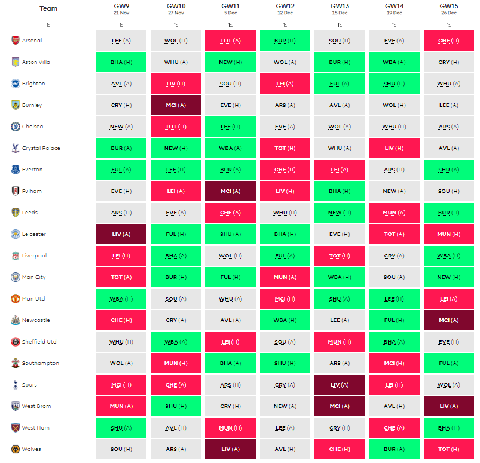

  סקירת לוח משחקים אחת לכמה מחזורים הינה לחם חוקו של מנג'ר הפנטזי המצוי, על אחת
  כמה וכמה כאשר אנחנו בדיוק מסיימים פגרת נבחרות ארורה, אשר בשילוב עם מגפת
  הקורונה, הובילה להיעדרות של מספר שחקני מפתח במחזורים הקרובים. בחינה של לוח
  המשחקים בחמשת המחזורים הקרובים תעזור לנו להבין את מי לצרף לסגלים החבולים שלנו
  בטווח הקצר והבינוני.

  נוסיף ונאמר, כי מי שהסגל שלו מרובה בהיעדרויות או שהוא פשוט מחזיק שחקנים שלא
  הוכיחו את עצמם עד עכשיו יכול בהחלט לחשוב על Wildcard במחזורים הקרובים, מה
  שכמובן מחייב בסקירה של לוח המשחקים בטווח הקרוב.

סקירה מלאה על איך ומתי להשתמש בצ'יפים נמצאת <a href="הציפים-שלנו">כאן</a>.

  <a href="הגיע-הזמן-אומרת-אימי-Wildcard-למחזור-9">הרכב מוצע</a> למי שהולך על ווילדקארד במחזור 9

Fixture Difficulty Rating (FDR) מ:
<a href="https://fantasy.premierleague.com/fixtures/fdr"> Fantasy Premier League</a>

<h3>לוח משחקים חגיגה</h3>
<h4>
  אסטון וילה – ברייטון (ב), ווסטהאם (ח), ניוקאסל (ב), וולבס (ח), ברנלי
    (ב)
</h4>

  אנחנו חייבים להודות שלמרות שהמלצנו לשים לב לנכסים ההתקפיים של וילה בפוסט הקודם
  שעסק בניתוח לוח המשחקים, חוסר היציבות של הקבוצה מבירמינגהאם גורם לנו לחשוש
  קצת, אבל אי אפשר להתווכח עם פתיחת העונה המרשימה שלה - מה עוד שהיא הקבוצה
  היחידה בליגה שלא עתידה לפגוש קבוצת Top 6 בשבעת המחזורים הקרובים.

  בחמשת המחזורים הקרובים, תשחק וילה שלושה משחקי בית נוחים מאוד ושני משחקי חוץ
  (בהם עדייו לא שמטה נקודה או ספגה שער העונה), כך שמבחינתנו כדאי לקחת את הסיכון
  עם שחקני וילה בכל העמדות (באמת שלא חשבנו שנגיד את זה), החל ממרטינז בשער, כלה
  במגנים השונים (שימו לב לטרגט – 4.5 מיליון ושיעור החזקה נמוך) וגם בחלק הקדמי,
  כאשר גריליש המצוין, בארקלי ו‑ווטקינס הם החשודים המיידיים.

<strong><em>ימשיך לספק ניקוד? גריליש.</em></strong>
 מקור, עמוד הפייסבוק:
<a href="https://www.facebook.com/OfficialFPL/"> OfficialFPL - Fantasy Premier League@</a>

<h4>
  לסטר – ליברפול(ח), פולהאם (ב), שפילד יונייטד (ח), ברייטון (ב), אברטון
    (ב)
</h4>

  מוליכת הטבלה ומלכת הפנדלים של ה – Top Flight (ממוצע של פנדל למשחק מתחילת
  העונה!) צועדת לקראת לוח משחקים מעולה, אשר כולל בחמשת המחזורים הקרובים שלושה
  משחקי בית ושני משחקי חוץ נוחים למדי מול מילואי ליברפול ושפילד יונייטד האנמית -
  משוכה בהחלט אפשרית לקבוצה שטרם שמטה נקודה בארבעת משחקי החוץ שלה העונה.

  לאור האמור לעיל, ממש לא היינו מהמרים נגד תחילתה של Vardy party חדשה, כאשר גם
  ג'וסטין, טילמאנס ובארנס נראים כמו אופציות טובות מאוד למחזורים הקרובים.

<strong><em>בדרך לעוד Vardy Party?</em></strong>
 מקור, עמוד הפייסבוק:
<a href="https://www.facebook.com/OfficialFPL/"> OfficialFPL - Fantasy Premier League@</a>

<h4>
  מנצ'סטר סיטי – טוטנהאם (ח), ברנלי (ב), פולהאם (ב), מנצ'סטר יונייטד (ח),
    ווסט ברום (ב)
</h4>

  אנחנו מודים שאנחנו קצת מעקמים את הפורמט והפעם מסתכלים עוד טיפה קדימה כדי
  להדגיש את הנקודה הבאה – בשבעת המחזורים הקרובים הסיטיזנס יפגשו בבית את ברנלי,
  פולהאם, ווסט ברום וניוקאסל.

Drop Mic.

  צחוק בצד, הקבוצה של פפ מספיק חזקה כדי להצליח גם במשחקי החוץ שלה בתקופה הזו
  (בטח בביקור באולד טראפורד), כך שאנחנו מרגישים בנוח לומר שזה הזמן להכניס לסגל
  שחקן או שניים של סיטי, כאשר דה ברויינה ואחד המגנים נראים לנו כמו שחקני מאסט
  בתקופה הקרובה. אם אתם מפחדים (ובצדק) מה – Pep Roulette אז אולי שווה בצד ההגנתי
  לדבוק בווקר או בדיאס, למרות שמבחינת השילוב של מחיר וסיכוי להחזר ניקוד התקפי,
  קאנסלו נראה מבטיח יותר.

<h3>כדאי לשים לב גם אליהן</h3>
<h4>
  ווסטהאם – שפילד יונייטד (ח), אסטון וילה (ב), מנצ'סטר יונייטד (ב), לידס (ח),
    קריסטל פאלאס (ב)
</h4>

  הפטישים נמצאים בכושר טוב, עם הפסד אחד בלבד בחמשת המשחקים האחרונים (וגם הוא
  באנפילד), כאשר בחמשת המחזורים הקרובים הם צפויים לשחק שלושה משחקי בית (בהם כבר
  שמרו פעמיים על רשת נקייה) ושני משחקי חוץ מול קבוצות שהגנה היא לא החלק החזק
  שלהן.

  היינו ממליצים לבחון מספר נכסים בעלי מחיר נוח מאוד דוגמת פאביאנסקי, קופאל,
  קרסוול בצד ההגנתי וסוצ'ק, בואן ופרנאלס בחלק ההתקפי, אשר יכולים להוות שחקנים
  משלימים טובים מאוד בסגל.

<h4>
  קריסטל פאלאס – ברנלי (ח), ניוקאסל (ב), ווסט ברום (ח), טוטנהאם (ב), ווסטהאם
    (ח)
</h4>

  בדומה לאסטון וילה, גם קריסטל פאלאס מופיעה בסקירת לוח המשחקים שלנו בפעם השנייה
  ברציפות, כאשר גם הפעם היא נהנית מלוח משחקים עם פוטנציאל ניקוד בשני צידי המגרש.
  המשחקים הקרובים בהחלט אמורים לאפשר לווילפריד זאהה להמשיך בפתיחת העונה החלומית
  שלו. מעבר לכך, יש לפאלאס מספר שחקנים במחירים נוחים דוגמת השוער גואיטה ושחקני
  הקישור טאונסרנד ואזה (מחיר נוח מאוד לשחקן שסיפק סטטיסטיקה מרשימה בעונה שעברה
  בצ'מפיונשיפ).

<h3>לא יכולנו להתעלם מהן אז היינו חייבים להתייחס בקצרה</h3>
<h4>
  ליברפול – לסטר (ב), ברייטון (ח), וולבס (ב), פולהאם (ח), טוטנהאם (ב)
</h4>

  שלושה משחקי בית וצמד משחקי חוץ נוחים מאוד גורמים לנו לחשוב שלכלול את מאנה
  וז'וטה בסגל זה לא רעיון רע בכלל (ושום מילה על ההגנה).

<h4>אברטון – פולהאם (ח), לידס (ב), ברנלי (ח), צ'לסי (ב), לסטר (ח)</h4>

שלושת המחזורים הקרובים נוחים מאוד – לא למהר על קלברט-לוין ודין.

<h4>
  ארסנל – לידס (ח), וולבס (ב), טוטנהאם (ח), ברנלי (ב), סאות'המפטון (ב)
</h4>

  פתיחת עונה לא יציבה, אבל עם שלושה משחקי בית בחמשת המחזורים הקרובים, אפשר לנסות
  את אובה ואולי גם שחקן הגנה.

<h4>
  מנצ'סטר יונייטד – ווסט ברום (ב), סאות'המפטון (ח), ווסטהאם (ח), מנצ'סטר סיטי
    (ב), שפילד יונייטד (ח)
</h4>

  לוח משחקים לא קל, אבל מול קבוצות שלא מתגאות בהגנות חזקות מידי – ברונו פרננדש,
  ראשפורד וה - VAR כבר מוכנים.

