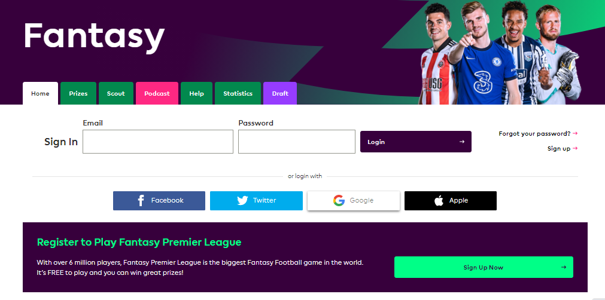

  משחק הפנטזי פרמייר ליג מאפשר לנו לקחת על עצמנו את תפקיד המנג'ר ולבנות באמצעות
  תקציב של 100 מיליון פאונד סגל וירטואלי המכיל 15 שחקנים מרחבי הליגה האנגלית
  (הפרמייר ליג).

  בכל שבוע משחקים, אנו נקבל ניקוד על סמך ביצועי השחקנים אותם בחרנו בקטגוריות
  שונות (הבקעת שערים, מתן אסיסטים, שמירה על רשת נקייה וכו').

  להסבר מפורט על חוקי המשחק, אופן קבלת הניקוד ושאר האפשרויות הקיימות בו –
  <a href="פנטזי-פרמייר-ליג-החוקים" class="link">לחצן כאן</a>.

  על מנת להתחיל לשחק, כל מה שעליכם לעשות הוא להתחבר לאתר
  <a href="https://fantasy.premierleague.com/"> Fantasy.premierleague.com </a> לפתוח חשבון באמצעות המייל או חשבון הפייסבוק שלכם
  ולהתחיל במלאכת בניית הקבוצה.

  אחרי שפתחתם קבוצה ועברתם על ההסבר המפורט שלנו על חוקי המשחק, כדאי לכם לקרוא את
  הטיפים השונים שלנו לשחקנים החדשים בנושאים הקריטיים לבניית קבוצה מצליחה –

  <a class="link" href="איך-בונים-קבוצה---טיפים-למנג'ר-המתחיל">איך בונים קבוצה - טיפים למנג'ר המתחיל</a>

  <a class="link" href="חילופים---ככה-עושים-את-זה-נכון">חילופים - ככה עושים את זה נכון</a>

<a class="link" href="הציפים-שלנו">צ'יפים - קווים לדמותם</a>

