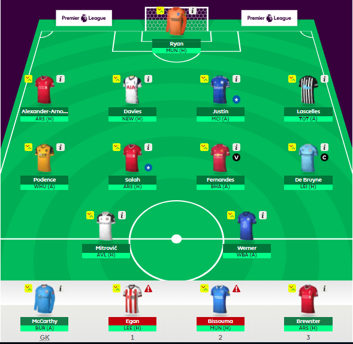
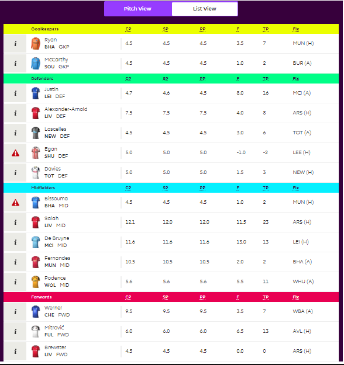
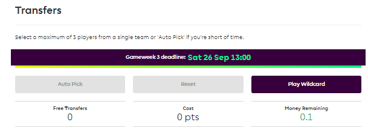
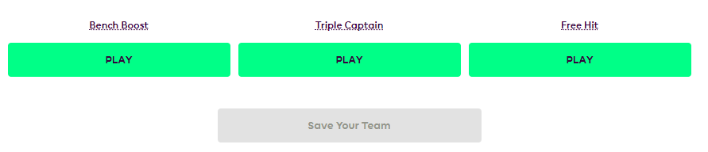
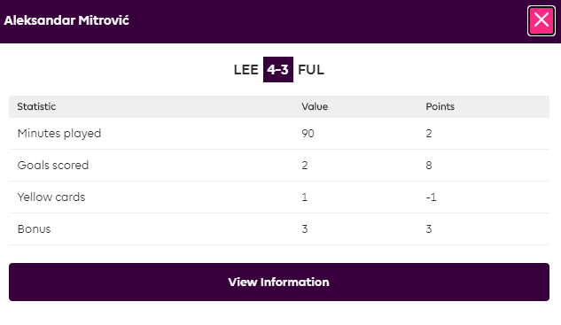
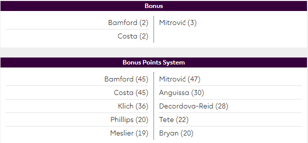

<h2>
  <strong><em>בחירת הסגל</em></strong>
</h2>

  ברוכים הבאים/השבים לפנטזי פרמייר ליג (Fantasy Premier League) – עולם
  שכולו טוב.

  בפסקאות הבאות נסקור את החוקים הבסיסיים והפחות בסיסיים של המשחק ונבין איך
  בונים קבוצה מנצחת.

  אז ככה, לרשותנו <strong>תקציב של 100 מיליון פאונד</strong>, אשר ישמש אותנו
  לבניית סגל של <strong>15 שחקנים</strong>, (תחת מגבלה של
  <strong>עד 3 שחקנים מקבוצה אחת</strong>), כאשר העמדות של כל השחקנים נקבעות
  בתחילת העונה והן קבועות לאורך העונה כולה.

חלוקת העמדות בסגל הינה כדלקמן –

<ul>
  <li>2 שוערים.</li>
  <li>5 שחקני הגנה.</li>
  <li>5 שחקני קישור.</li>
  <li>3 שחקני התקפה.</li>
</ul>

צילום מסך של קבוצה מלאה

  פעם ראשונה שאתם מרכיבים קבוצה?
   תבדקו את ההמלצות שלנו לניצול נכון של התקציב בעת בניית הסגל.

<h2>
  <strong><em>ניהול הסגל</em></strong>
</h2>

  בכל מחזור משחקים (Game week – GW) עלינו לבחור מתוך הסגל שבחרנו 11 שחקנים
  להרכב הפותח, כאשר אנו מחויבים לכלול בהרכב שוער, מינימום של שלושה שחקני
  הגנה ושחקן התקפה אחד לכל הפחות (כן, זה אומר שניתן לשחק בטקטיקה המוזרה והלא
  מומלצת של 5-2-3).

  בכל מחזור משחקים, עלינו לבחור קפטן וקפטן-משנה,
  <strong>כאשר כמות הנקודות של הקפטן באותו מחזור משחקים תוכפל</strong>.
  במידה והקפטן שבחרנו לא משחק כלל באותו מחזור משחקים, אז הזכאות לניקוד הכפול
  עוברת לקפטן המשנה.

  במידה וגם הקפטן וגם קפטן המשנה לא משחקים במחזור משחקים מסוים – הזכאות
  לניקוד כפול עבור שחקן בודד במחזור המשחקים הספציפי הזה מבוטלת (וזה כנראה
  אומר שהתייאשתם מהקבוצה והפסקתם לעשות חילופים...).

  שאר ארבעת השחקנים הנותרים בסגל נותרים על הספסל
  <strong>והודות למנגנון החילופים האוטומטי </strong>הם ממש לא סיימו את
  תפקידם, יתר על כן,
  <strong>ישנה חשיבות לאופן סידור שחקני השדה המחליפים על הספסל</strong>.

  במידה ושחקן מסוים לא משחק כלל במחזור משחקים מסוים, מבוצעים חילופים
  אוטומטיים, כך ששחקני ספסל שכן שיחקו במהלך מחזור המשחקים יכנסו להרכב הפותח,
  כך הניקוד על הופעתם יתווסף לסך הניקוד השבועי.

  כעיקרון, החילופים האוטומטיים מבוצעים לפי סדר הופעת שחקני השדה המחליפים על
  ספסל הקבוצה (משמאל לימין, כך שהמחליף השמאלי ביותר הינו הראשון), אך הם
  מבוצעים תוך שמירה על העיקרון של 3 שחקני הגנה לכל הפחות בהרכב הסופי שלנו.

  כך לדוגמא – במידה והמערך שבחרתי לשבוע משחקים מסוים הינו 3-5-2, זה אומר
  ששחקני השדה המחליפים שלי הם שני שחקני הגנה ושחקן התקפה אחד.

  במידה ואחד משחקני הקישור לא שיחק, אזי המערך הסופי יהיה 4-4-2 או 3-4-3
  בהתאם לסדר בו מוקמו שחקני השדה על ספסל המחליפים.

  החלק המעניין יותר הוא במידה ושחקן הגנה לא שיחק, במקרה כזה, לאור העובדה
  שאנו מחויבים לשחק עם שלושה שחקני הגנה לכל הפחות, שחקן הגנה יוקפץ להרכב
  הפותח <strong>גם אם הוא ממוקם בסדר ההחלפה לאחר שחקן ההתקפה.</strong>

  לכן, חשוב לזכור שישנה חשיבות גם למיקום המחליף השני והשלישי (בעיקר אם הם
  שני שחקני הגנה).

<h2>
  <strong><em>העברות</em></strong>
</h2>

  החלק החשוב ביותר במהלך עונת הפנטזי ליג הוא ביצוע העברות בצורה מושכלת במהלך
  העונה.

חלון החילופים – גרסת הרשימה

  <em
    >מהם העקרונות המנחים בעת ביצוע חילופים? בואו לחסוך מלא נקודות ותקראו את
    ההמלצות שלנו בנושא.</em
  >

  עד לפתיחת העונה (למען הדיוק – הדד ליין של המחזור הראשון לעונה), ניתן לבצע
  חילופים ללא הגבלה, וחשוב יותר – בחינם.

  מרגע פתיחת העונה (שוב – הדד ליין של המחזור הראשון לעונה), אנו מקבלים
  אפשרות לביצוע <strong>העברה אחת בחינם בכל מחזור משחקים</strong>, כאשר
  <strong>כל העברה נוספת </strong>מעבר להעברה הזו באותו מחזור משחקים
  <strong>תעלה לנו בקנס של 4 נקודות.</strong>

  שימו לב, במידה ולא ניצלתם את ההעברה החינמית במחזור מסוים, העברה זו תיצבר
  ובמחזור המשחקים העוקב תוכלו לבצע שתי העברות בחינם (מבלי לפגוע בסך הנקודות
  שצברתם עד שלב זה).

  <strong>שימו לב כי לא ניתן לצבור מעבר לשתי העברות חופשיות</strong>, כאשר
  כל ההעברות החופשיות שלא תנצלו מהרגע שבו כבר צברתם שתי העברות חופשיות –
  פשוט תעלמנה. למען הסר ספק, במידה ובשבוע בו יש לכם שתי העברות חופשיות,
  השתמשתם בהעברה אחת בלבד, אזי במחזור המשחקים העוקב תהיו זכאים לשתי העברות
  חופשיות פעם נוספת.

<h3>
  <strong><em>מחירי השחקנים במהלך העונה</em></strong>
</h3>

  אחרי שהבנו את מנגנון ביצוע החילופים חשוב להתעכב על נושא
  <strong>מחירי ההעברה של השחקנים</strong
  ><strong>וכיצד המחירים הללו עלולים להשתנות.</strong>

  עם פתיחת העונה נקבע מחיר לכל שחקן ושחקן הנמצא בסגלי הקבוצות השונות, כאשר
  המחיר הזה קבוע עד לתום מחזור המשחקים הראשון לעונה.

  עם תום מחזור המשחקים הראשון של העונה, יחלו שינויים במחירים של השחקנים
  השונים בהתאם לביקוש שלהם על ידי כלל שחקני הפנטזי. השינוי במחיר של שחקן
  ספציפי תלוי באלגוריתם ולצורך הפשטות נאמר שהוא מושפע
  <strong>מאחוז השינוי </strong>בבעלות על שחקן מסוים במהלך מחזור משחקים בודד.
  נשים לב כי השינוי המקסימלי בערכו של שחקן לא יעלה על 0.1M ביום בודד ו-0.3M
  במחזור משחקים בודד.

  כמובן, שהערך המצרפי של הסגל שלנו משתנה בהתאם לשינויי במחיריהם של כלל
  השחקנים הקיימים בסגל שלנו בכל רגע נתון. על כן, ישנם שחקני פנטזי אשר
  מקפידים לשמור על ערך גבוה של השחקנים בקבוצה, בעיקר במחזורים הראשונים עד
  לניצול ה-Wild Card הראשון של העונה, גם אם זה בא על חשבון חילופים מרובים
  הגוררים קנס. (<em>אנחנו מדברים על זה פה</em>).

  בכל מקרה, במידה ותמכרו <strong>שחקן אשר ערכו ירד </strong>במהלך השהות שלו
  בסגל שלכם, אתם תספגו את כל ירידת הערך שנזקפה בגינו ממועד רכישתו עד למועד
  מכירתו.

  עבור <strong>שחקן שעלה ערכו </strong>במהלך שהותו בסגל שלכם, אתם תקבלו
  עליית ערך בגובה מחצית מעליית הערך, כאשר במקרה הצורך היא תעוגל כלפי מטה
  ב-0.1M.  נסביר בדוגמא – נניח ורכשנו את הארי קיין במחיר של 10.5M
  והחלטנו למכור אותו כאשר מחירו הינו 10.8M. מכיוון ובמקרה הזה מחצית מעליית
  הערך הינה 0.15M והמחירים במשחק מעוגלים בספרה אחת בלבד, אזי עליית הערך
  שתיזקף הינה 0.1M בלבד. כמובן שבמידה ובדוגמא שלנו נמכור את קיין במחיר של
  10.9M, אזי עליית הערך שתתווסף לסך שווי הסגל שלנו הינה 0.2M.

בכל שלב, נוכל לראות מהו הסכום שנקבל בעת מכירה של שחקן שנמצא בסגל שלנו בלשונית List View שנמצאת תחת לשונית החילופים (Transfers). 
בצילום המסך המופיע מעלה נוכל למצוא בטור המספרי השמאלי ביותר את ערכו הנוכחי של השחקן (CP – Current Price), בטור לימינו את מחיר המכירה שלו (SP – Selling Price) ובטור השלישי מימין את עלות השחקן בעת שנרכש (PP – Purchase Price).

<h2>
  <strong><em>צ'יפים</em></strong>
</h2>

  במשחק הפנטזי פריימר ליג אנו מקבלים בסך הכל <strong>חמישה </strong>צ'יפים
  בהם אנו יכולים לעשות שימוש על מנת למקסם את כמות הנקודות שאנו צוברים במהלך
  העונה.

  שימו לב,
  <strong>ניתן להשתמש בצ'יפ אחד בלבד במהלך מחזור משחקים בודד.</strong>

  כמו כן, שימוש בצ'יפ גורר
  <strong>איפוס של כמות ההעברות הצבורה </strong>הקיימת לנו נכון לתחילת המחזור
  בו אנו משתמשים בצ'יפ. כלומר, במידה והיו לנו שתי העברות שמורות, במחזור
  העוקב למחזור המשחקים בו השתמשנו בצ'יפ נהיה זכאים להעברה חופשית אחת בלבד.

אפשרות שימוש בצ'יפ Wildcard

אפשרות שימוש בצ'יפים האחרים

אלו הם הצ'יפים שעומדים לרשותנו במהלך העונה –

<h3><strong>כרטיס חילופים חופשי (Wildcard) – פעמיים במהלך העונה</strong></h3>

  צ'יפ זה מאפשר לנו לבצע מספר חילופים בלתי מוגבל במהלך מחזור משחקים מסוים
  (כולל חילופים שכבר בוצעו במהלך מחזור המשחקים המדובר) – בחינם וללא קנס.

  במהלך העונה נוכל להשתמש פעמיים בצ'יפ זה, כאשר הפעם הראשונה
  <strong>חייבת להיות עד לדד ליין של המחזור ה-16</strong
  ><strong>בתאריך 28.12.2020 בשעה 17:30 (שעון ישראל)</strong>והפעם השנייה
  תהיה לאחר תאריך זה. במידה ולא נשתמש בצ'יפ הראשון עד לתאריך הנזכר לעיל, אזי
  הזכאות לשימוש בו תפוג.

איך ומתי להשתמש בצ'יפים במהלך העונה? התשובות כאן.

<h3><strong>Triple Captain</strong></h3>

  צ'יפ זה מאפשר לנו לשלש במחזור משחקים מסוים את הניקוד של הקפטן שלנו, על
  חשבון ההכפלה הרגילה של ניקוד הקפטן במחזור משחקים רגיל. כמובן שאם הקפטן
  שלנו כלל לא שיחק במחזור המשחקים בו השתמשנו בצ'יפ, אזי ההטבה עוברת לקפטן
  המשנה.

<h3><strong>Bench Boost</strong></h3>

  צ'יפ זה מאפשר לנו להוסיף לסך הנקודות הנצבר גם את הניקוד של שחקני הספסל
  שלנו, כך שלמעשה הניקוד של כל 15 שחקני הסגל ייחשב במחזור המשחקים בו נפעיל
  את הצ'יפ.

<h3><strong>Free Hit</strong></h3>

  צ'יפ זה מאפשר לנו לבצע כמות חילופים בלתי מוגבלת במחזור משחקים מסוים,
  <strong>עבור מחזור משחקים מסוים, </strong>כך שבתום מחזור המשחקים בו הפעלנו
  את הצ'יפ נחזור אל הסגל שהיה לנו טרם הפעלת הצ'יפ.

<h2>
  <strong><em>ניקוד</em></strong>
</h2>

  <em
    >במהלך העונה, צוברים השחקנים בקבוצות השונות ניקוד בהתאם להופעתם במסגרת
    משחקי הפרמייר ליג. הניקוד מחושב כדלקמן –
  </em>

<table>
  <thead>
    <tr>
      <th>
        

          <strong><em>פעולה</em></strong>
        

      </th>
      <th>
        

          <strong><em>ניקוד</em></strong>
        

      </th>
    </tr>
  </thead>
  <tbody>
    <tr>
      <td>
        
<em>שחקן המשחק פחות מ-60 דקות</em>

      </td>
      <td>
        
<em>1</em>

      </td>
    </tr>
    <tr>
      <td>
        
<em>שחקן המשחק יותר מ-60 דקות (לא כולל תוספות זמן)</em>

      </td>
      <td>
        
<em>2</em>

      </td>
    </tr>
    <tr>
      <td>
        
<em>שער המובקע על ידי שוער או שחקן הגנה</em>

      </td>
      <td>
        
<em>6</em>

      </td>
    </tr>
    <tr>
      <td>
        
<em>שער המובקע על ידי שחקן קישור</em>

      </td>
      <td>
        
<em>5</em>

      </td>
    </tr>
    <tr>
      <td>
        
<em>שער המובקע על ידי שחקן התקפה</em>

      </td>
      <td>
        
<em>4</em>

      </td>
    </tr>
    <tr>
      <td>
        

          <em>בישול שער (אסיסט)</em><strong><em>*</em></strong>
        

      </td>
      <td>
        
<em>3</em>

      </td>
    </tr>
    <tr>
      <td>
        

          <em
            >שמירה על שער נקי על ידי שוער או שחקן הגנה (כל עוד שיחק מעל 60
            דקות)</em
          ><strong><em>*</em></strong>
        

      </td>
      <td>
        
<em>4</em>

      </td>
    </tr>
    <tr>
      <td>
        

          <em
            >שמירה על שער נקי על ידי שחקן קישור (כל עוד שיחק מעל 60
            דקות)</em
          ><strong><em>*</em></strong>
        

      </td>
      <td>
        
<em>1</em>

      </td>
    </tr>
    <tr>
      <td>
        
<em>כל 3 הצלות שמבוצעות על ידי שוער</em>

      </td>
      <td>
        
<em>1</em>

      </td>
    </tr>
    <tr>
      <td>
        
<em>שוער אשר מציל כדור עונשין מ-11 מטרים</em>

      </td>
      <td>
        
<em>5</em>

      </td>
    </tr>
    <tr>
      <td>
        
<em>שחקן אשר מחטיא כדור עונשין מ-11 מטרים</em>

      </td>
      <td>
        
<em>2-</em>

      </td>
    </tr>
    <tr>
      <td>
        

          <em>נקודות בונוס הניתנות לשחקנים המצטיינים בכל משחק</em
          ><strong><em>*</em></strong>
        

      </td>
      <td>
        
<em>1-3</em>

      </td>
    </tr>
    <tr>
      <td>
        
<em>כל שני שערים שהקבוצה סופגת – שוער ושחקני הגנה</em>

      </td>
      <td>
        
<em>1-</em>

      </td>
    </tr>
    <tr>
      <td>
        
<em>כרטיס צהוב</em>

      </td>
      <td>
        
<em>1-</em>

      </td>
    </tr>
    <tr>
      <td>
        

          <em>כרטיס אדום</em><strong><em>*</em></strong>
        

      </td>
      <td>
        
<em>3-</em>

      </td>
    </tr>
    <tr>
      <td>
        
<em>שער עצמי</em>

      </td>
      <td>
        
<em>2-</em>

      </td>
    </tr>
  </tbody>
</table>

ניקוד של שחקן כלשהו במשחק מסוים

<h3>
  <strong><em>אסיסט</em></strong>
</h3>

  <em
    >במסגרת ה"פנטזי פרמייר ליג" אסיסט ייזקף לזכותו של שחקן במספר מקרים –
  </em>

<ul>
  <li>
    <em
      >שחקן אשר מסר לשחקן אשר הבקיע שער - כל עוד לא בוצעה התערבות של שחקן
      יריב אשר הסיטה את כיוון הכדור בצורה משמעותית.</em
    >
  </li>
  <li>
    <em
      >במידה ונכבש שער לאחר הדיפה של השוער היריב, השחקן אשר בעט את הבעיטה
      הראשונית לשער יזוכה באסיסט.</em
    >
  </li>
  <li>
    <em
      >במידה ונכבש שער עצמי, השחקן אשר בעט את הבעיטה הראשונית יזוכה
      באסיסט.</em
    >
  </li>
  <li>
    <em
      >במידה ונכבש שער מבעיטת עונשין מ-11 מטרים או מבעיטה חופשית, השחקן
      שהוכשל יזוכה באסיסט.</em
    >
  </li>
</ul>

  <em
    >שימו לב כי במקרה של מחלוקת לגבי אסיסט במשחק מסוים, יכול ויהיה שינוי
    בניקוד השחקנים, לא יאוחר משעה עד לתום המשחק האחרון במחזור המשחקים
    הרלוונטי.</em
  >

<h3><strong>שער נקי</strong></h3>

  במידה ושוער או שחקן הגנה שיחק לפחות 60 דקות הוא יהיה זכאי לבונוס של 4
  נקודות בגין שמירה על שער נקי. שימו לב, שבמידה והשחקן שיחק מינימום 60
  וקבוצתו ספגה שער בזמן שכבר הוחלף/טרם נכנס למגרש – הבונוס עדיין יינתן.

<h3><strong>כרטיס אדום</strong></h3>

  הורדת הניקוד בגין כרטיס אדום כבר כוללת בתוכה הורדת ניקוד בגין כרטיס צהוב.

  שימו לב שבמידה ושחקן הורחק, הוא עדיין ממשיך להיות חשוף להורדות ניקוד בגין
  ספיגת שערים המתרחשים לאחר הרחקתו מהמגרש.

<h3>
  <strong><em>נקודות בונוס</em></strong>
</h3>

  מערך ניקוד הבונוס (BPS) מבוססת על ניקוד הניתן לכל השחקנים במהלך משחק, כאשר
  בסופו, שלושת השחקנים עם הניקוד המצטבר הגבוה ביותר מקבלים נקודות בונוס
  (למעט חריג שיוסבר מיד).

  במידה ושני שחקנים מקבלים את הניקוד המצטבר הגבוה ביותר אזי כל אחד מהם יקבל
  3 נקודות בונוס והשחקן במקום השלישי יקבל נקודת בונוס בודדת.

  במידה ושני השחקנים במקום השני והשלישי קיבלו ניקוד מצטבר זהה, אזי המקום
  הראשון יקבל 3 נקודות בונוס ושני הסגנים שלו 2 נקודות בונוס כ"א.

  במידה וישנו תיקו בין מספר שחקנים במקום השלישי בניקוד המצטבר, אזי המקום
  הראשון יקבל 3 נקודות בונוס, המקום השני יקבל 2 נקודות בונוס והשחקנים במקום
  השלישי המשותף יקבלו נקודת בונוס אחת כ"א (במקרה הזה יכולים להיות יותר
  משלושה שחקנים אשר זכאים לנקודות בונוס במשחק מסוים).

ניקוד בונוס ממשחק מסוים

חישוב נקודות הבונוס המצטבר במהלך המשחק יחושב כדלקמן –

<table>
  <thead>
    <tr>
      <th>
        

          <strong><em>פעולה</em></strong>
        

      </th>
      <th>
        

          <strong><em>ניקוד</em></strong>
        

      </th>
    </tr>
  </thead>
  <tbody>
    <tr>
      <td>
        
<em>שחקן המשחק פחות מ-60 דקות</em>

      </td>
      <td>
        
<em>3</em>

      </td>
    </tr>
    <tr>
      <td>
        
<em>שחקן המשחק יותר מ-60 דקות (לא כולל תוספות זמן)</em>

      </td>
      <td>
        
<em>6</em>

      </td>
    </tr>
    <tr>
      <td>
        
<em>שער המובקע על ידי שוער או שחקן הגנה</em>

      </td>
      <td>
        
<em>12</em>

      </td>
    </tr>
    <tr>
      <td>
        
<em>שער המובקע על ידי שחקן קישור</em>

      </td>
      <td>
        
<em>18</em>

      </td>
    </tr>
    <tr>
      <td>
        
<em>שער המובקע על ידי שחקן התקפה</em>

      </td>
      <td>
        
<em>24</em>

      </td>
    </tr>
    <tr>
      <td>
        
<em>בישול שער (אסיסט)</em>

      </td>
      <td>
        
<em>9</em>

      </td>
    </tr>
    <tr>
      <td>
        

          <em
            >שמירה על שער נקי על ידי שוער או שחקן הגנה (כל עוד שיחק מעל 60
            דקות)</em
          >
        

      </td>
      <td>
        
<em>12</em>

      </td>
    </tr>
    <tr>
      <td>
        
<em>שוער אשר מציל כדור עונשין מ-11 מטרים</em>

      </td>
      <td>
        
<em>15</em>

      </td>
    </tr>
    <tr>
      <td>
        
<em>כל הצלה שמבוצעות על ידי שוער</em>

      </td>
      <td>
        
<em>2</em>

      </td>
    </tr>
    <tr>
      <td>
        
<em>מסירה מוצלחת במגרש הפתוח</em>

      </td>
      <td>
        
<em>1</em>

      </td>
    </tr>
    <tr>
      <td>
        
<em>יצירת מצב ודאי לכיבוש שער</em>

      </td>
      <td>
        
<em>3</em>

      </td>
    </tr>
    <tr>
      <td>
        
<em>כל 2 הרחקות, עצירות ו/או חסימות</em>

      </td>
      <td>
        
<em>1</em>

      </td>
    </tr>
    <tr>
      <td>
        
<em>כל 3 חילוצי/חטיפות כדור</em>

      </td>
      <td>
        
<em>1</em>

      </td>
    </tr>
    <tr>
      <td>
        
<em>מסירת מפתח</em>

      </td>
      <td>
        
<em>1</em>

      </td>
    </tr>
    <tr>
      <td>
        

          <em
            >כל שני תיקולים מוצלחים, נטו (כלומר, בנטרול תיקולים לא
            מוצלחים)</em
          >
        

      </td>
      <td>
        
<em>2</em>

      </td>
    </tr>
    <tr>
      <td>
        
<em>ביצוע דריבל מוצלח</em>

      </td>
      <td>
        
<em>1</em>

      </td>
    </tr>
    <tr>
      <td>
        
<em>הבקעת שער ניצחון</em>

      </td>
      <td>
        
<em>3</em>

      </td>
    </tr>
    <tr>
      <td>
        
<em>אחוז מסירות מוצלח של 70-79% (מינימום 30 מסירות)</em>

      </td>
      <td>
        
<em>2</em>

      </td>
    </tr>
    <tr>
      <td>
        
<em>אחוז מסירות מוצלח של 80-89% (מינימום 30 מסירות)</em>

      </td>
      <td>
        
<em>4</em>

      </td>
    </tr>
    <tr>
      <td>
        
<em>אחוז מסירות מוצלח של מעל ל-90%</em>

      </td>
      <td>
        
<em>6</em>

      </td>
    </tr>
    <tr>
      <td>
        
<em>הכשלת שחקן יריב לכדור עונשין מ-11 מטרים</em>

      </td>
      <td>
        
<em>3-</em>

      </td>
    </tr>
    <tr>
      <td>
        
<em>החמצת כדור עונשין מ-11 מטרים</em>

      </td>
      <td>
        
<em>6-</em>

      </td>
    </tr>
    <tr>
      <td>
        
<em>כרטיס צהוב</em>

      </td>
      <td>
        
<em>3-</em>

      </td>
    </tr>
    <tr>
      <td>
        
<em>כרטיס אדום</em>

      </td>
      <td>
        
<em>9-</em>

      </td>
    </tr>
    <tr>
      <td>
        
<em>שער עצמי</em>

      </td>
      <td>
        
<em>6-</em>

      </td>
    </tr>
    <tr>
      <td>
        
<em>החמצת מצב ודאי לכיבוש שער</em>

      </td>
      <td>
        
<em>3-</em>

      </td>
    </tr>
    <tr>
      <td>
        
<em>ביצוע טעות שמובילה לספיגת שער</em>

      </td>
      <td>
        
<em>3-</em>

      </td>
    </tr>
    <tr>
      <td>
        
<em>ביצוע טעות שמובילה להזדמנות לכיבוש שער </em>

      </td>
      <td>
        
<em>1-</em>

      </td>
    </tr>
    <tr>
      <td>
        
<em>ספיגת תיקול</em>

      </td>
      <td>
        
<em>1-</em>

      </td>
    </tr>
    <tr>
      <td>
        
<em>ביצוע עבירה</em>

      </td>
      <td>
        
<em>1-</em>

      </td>
    </tr>
    <tr>
      <td>
        
<em>שחקן הנתפס בנבדל</em>

      </td>
      <td>
        
<em>1-</em>

      </td>
    </tr>
    <tr>
      <td>
        
<em>בעיטה מחוץ למסגרת</em>

      </td>
      <td>
        
<em>1-</em>

      </td>
    </tr>
  </tbody>
</table>